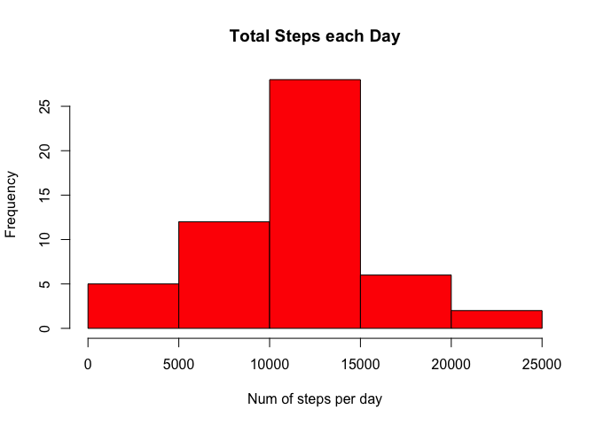

# Rep Res Peer Assignment 1

 
# Reproducible Research: Peer Assessment 1

```r
activity <- read.csv("activity.csv")
```

## Mean and median total number of steps taken per day and histogram plotting  


```r
steps_per_day <- aggregate(steps~date, activity, sum)
hist(steps_per_day$steps, main=paste("Total Steps each Day"), col="red", xlab="Num of steps per day")
```

<!-- -->

```r
mean_steps <- mean(steps_per_day$steps)
median_steps <- median(steps_per_day$steps)
```

Mean steps are 1.0766189\times 10^{4} and median steps are 10765

##Average daily activity pattern  


Time series plot : Avg steps vs interval


```r
steps_per_interval <- aggregate(steps~interval, activity, mean)

plot(steps_per_interval$interval, steps_per_interval$steps, type="l", xlab="Interval", ylab="Steps", main="Average number of steps per interval")
```

<!-- -->

Which interval has max number of steps - 

```r
max_interval <- steps_per_interval[which.max(steps_per_interval$steps),]
```

The interval number 835 has max steps

##Missing values  

1. Total number of missing values : 


```r
num_missing_val <- sum(is.na(activity$steps))
```

Total number of missing values : 2304

## Fill in missing values

```r
library(plyr)
impute.mean <- function(x) replace(x, is.na(x), mean(x,na.rm=TRUE))
activity_no_na <- ddply(activity, ~ interval, transform, steps=impute.mean(steps))
```

##Recount total steps per day, Mean , Median of steps per day after filling in missing data

```r
steps_per_day <- aggregate(steps~date, activity_no_na, sum)
hist(steps_per_day$steps, main=paste("Total Steps each Day"), col="blue", xlab="Num of steps per day")
```

<!-- -->

```r
mean_new <- mean(steps_per_day$steps)
median_new <- median(steps_per_day$steps)
```

New Mean steps are 1.0766189\times 10^{4} and new median steps are 1.0766189\times 10^{4}

Hence we see that the values for mean remain the same but median becomes same as mean when data is filled in

## Difference between total daily steps with NAs and without NAs in activity data set

```r
total_daily_steps_1 <- aggregate(steps~date, activity, sum)
total_daily_steps_1 <- sum(total_daily_steps_1$steps)

total_daily_steps_2 <- aggregate(steps~date, activity_no_na, sum)
total_daily_steps_2 <- sum(total_daily_steps_2$steps)
```
Total steps when data is missing : 570608 
Total steps when data is filled in : 6.5673751\times 10^{5}

Hence we can compute more number of steps when data is imputed

## Difference in activity patterns for Weekdays and Weekends


```r
weekdays <- c("Monday", "Tuesday", "Wednesday", "Thursday", "Friday")
activity_no_na$day <- as.factor(ifelse(is.element(weekdays(as.Date(activity_no_na$date)),weekdays), "Weekday", "Weekend"))
steps_per_interval_new <- aggregate(steps ~ interval +day, activity_no_na, mean)

library(lattice)

xyplot(steps_per_interval_new$steps ~ steps_per_interval_new$interval|steps_per_interval_new$day, main="Average Steps per Day by Interval",xlab="Interval", ylab="Steps",layout=c(1,2), type="l")
```

<!-- -->

